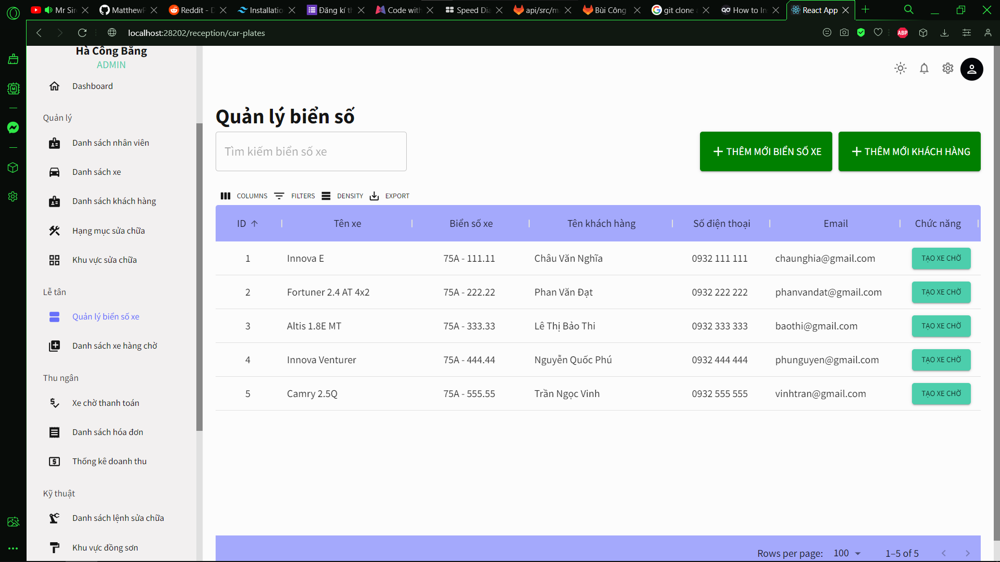
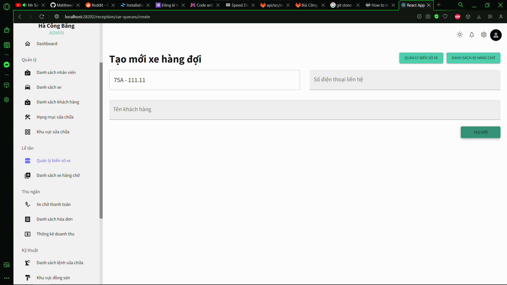
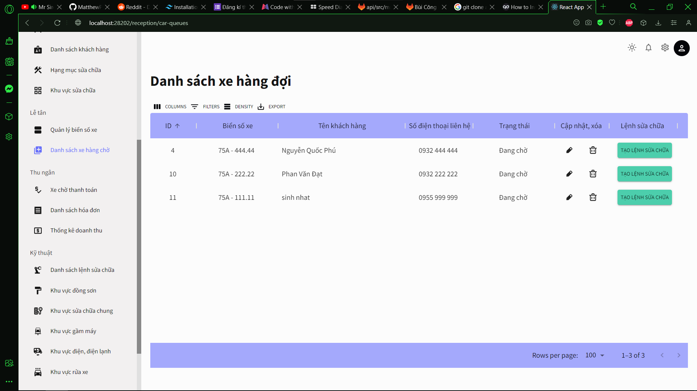
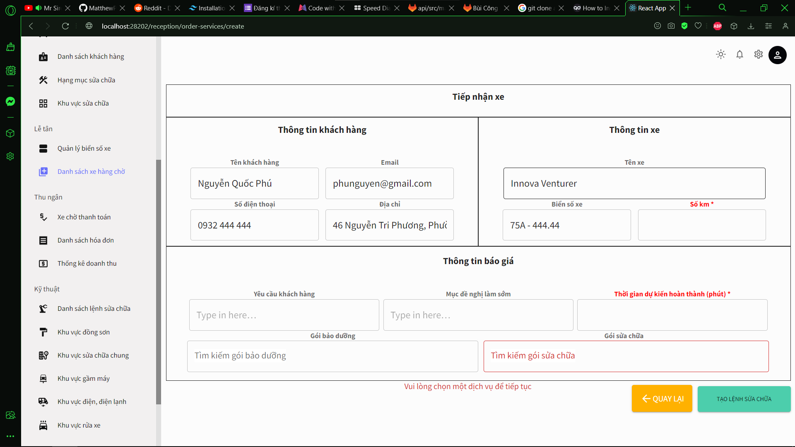
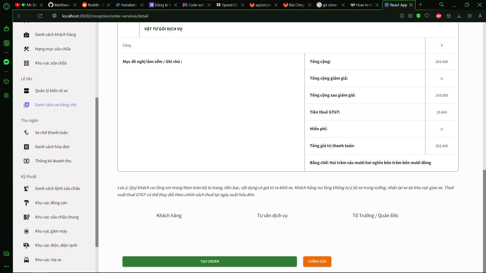
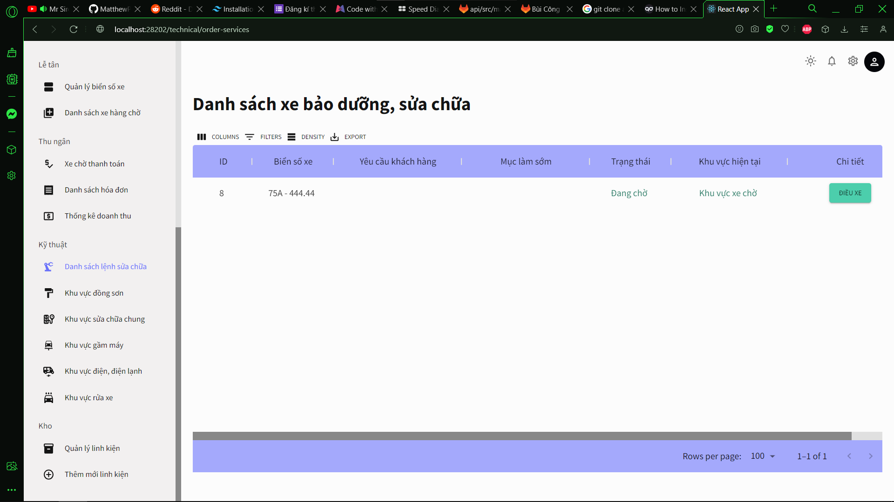
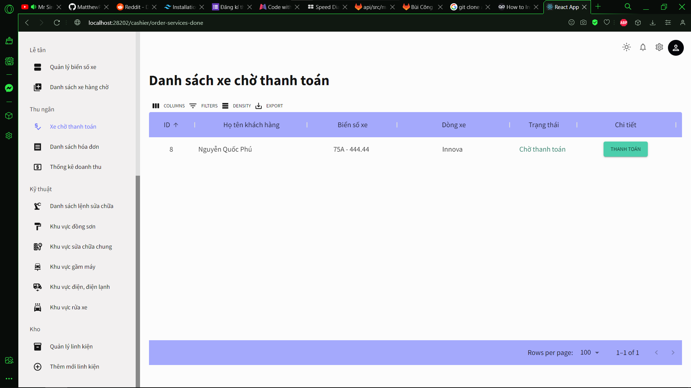
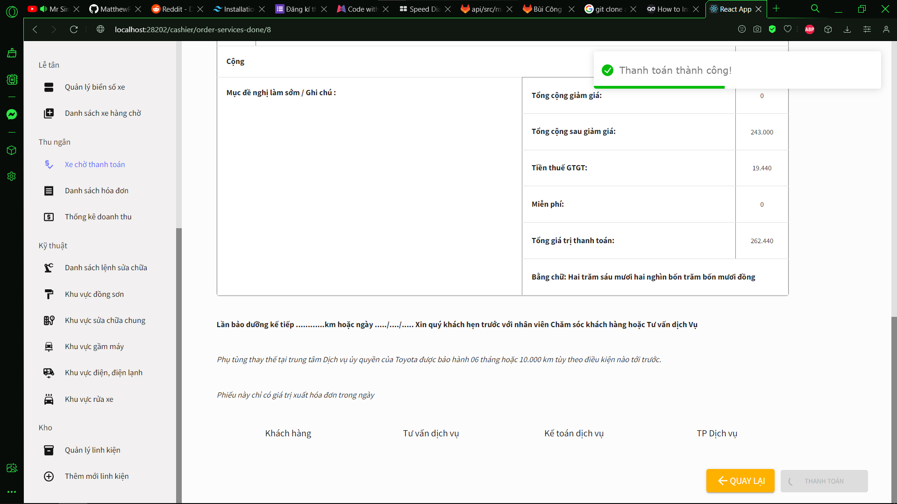

# Toyota-car-maintenance-process

Before running project

Please take follow a step

1. Create new schema at MySQL

2. Change your password to access MySQL at module application/src/main/resources application-dev.properties

3. Run IntelliJ IDEA 

4. At MySQL running file toyota-update-bill-full.sql

5. At reactjs-dashboard-toyota-car-maintenance-process in VSCODE running commane line
 `npm i`,  `npm start`

6. At nodejs-manage-toyota-car-maintenance-process in VSCODE running commane line 
 `npm i`,  `node .`

# The project follows the main stream.

Step 1. 

In this page, click on the "Create car queue" button.

Step 2.

Enter the contact phone number, name, and then click on 'Create New'.

Step 3.

On this page, click on the "Create Repair Order" button.

Step 4.

On this page, enter the time, mileage, select the repair package, and then click the "Create Repair Order" button.

Step 5. 

Step 6.

Step 7.

Step 8.

